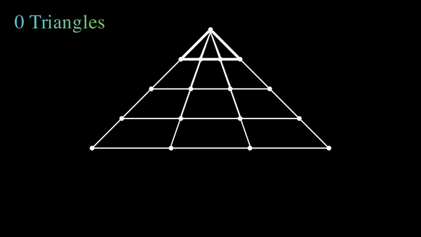

# Powered By:

    
     
     
    
    
    
    
    
    <a href="https://twitter.com/manim_community/">
    
    <a href="https://github.com/psf/black">
    
    
    
     
     
    <i>An animation engine for explanatory math videos</i>

### Hi there, I'm Zheer 👋

## I'm a Software Engineer and student!!

- 🌱 I’m currently learning everything 🤣
- 👯 I’m looking to collaborate with other content creators
- ⚡ Fun fact: I love to draw and play

### Connect with me:

[ https://www.linkedin.com/in/zaheer-ud-din-faiz-27b54318b/][linkedin]

 

### Languages and Tools:

[][webdevplaylist]
[][reactplaylist]
[][webdevplaylist]
[][webdevplaylist]
[][webdevplaylist]
[][webdevplaylist]

 
 

---

### Motivation
I saw this post wanted to solve it using animation. That's what got me into [manim]('https://github.com/ManimCommunity/manim') 

 
 

 
 
And I ended up making this

 
 

---
[website]: https://codeSTACKr.com
[course]: http://vsCodeHero.com
[twitter]: https://twitter.com/codeSTACKr
[youtube]: https://youtube.com/codeSTACKr
[instagram]: https://instagram.com/codeSTACKr
[linkedin]: https://linkedin.com/in/codeSTACKr
[webdevplaylist]: https://www.youtube.com/playlist?list=PLkwxH9e_vrAJ0WbEsFA9W3I1W-g_BTsbt
[jsplaylist]: https://www.youtube.com/playlist?list=PLkwxH9e_vrALRJKu7wfXby3MKeflhTu6B
[cssplaylist]: https://www.youtube.com/playlist?list=PLkwxH9e_vrALSdvZuEh6gqQdmDoDIoqz4
[reactplaylist]: https://www.youtube.com/playlist?list=PLkwxH9e_vrAK4TdffpxKY3QGyHCpxFcQ0
